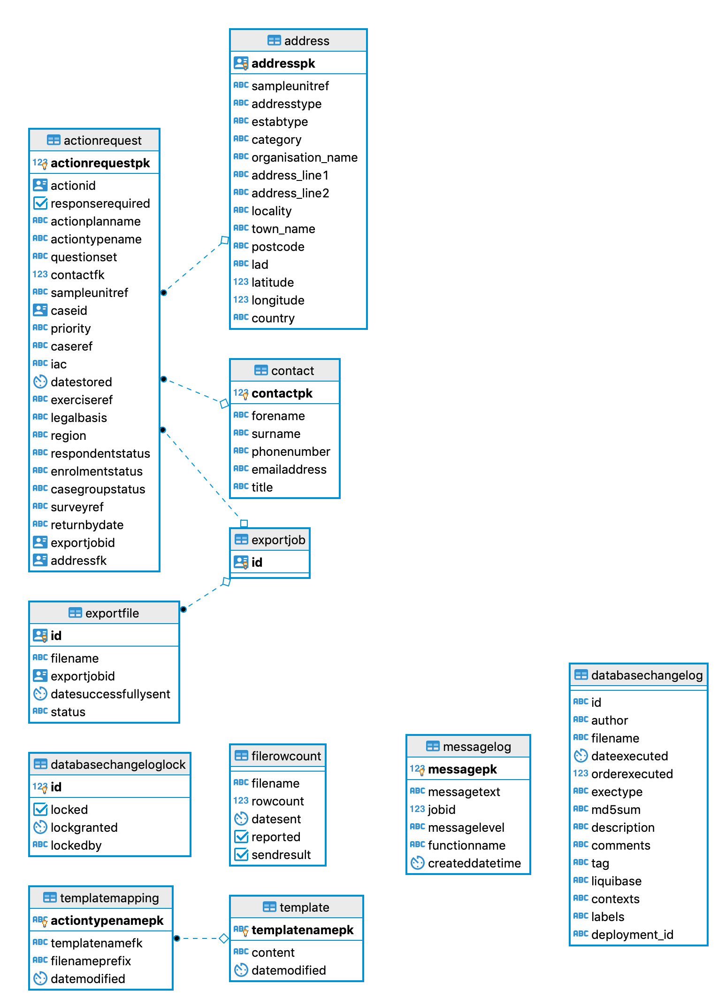

# Action Exporter Database

## Database Schema 

### Action Request
This is the main table used by the action exporter and this is where it stores any action instructions requests it 
receives from the action service. Action instructions are generally requests to create an entry in a print file along
with the data needed for that entry.

### Contact
Populated from the action request instruction if the action request has a contact field.
This table contains contact information, quite often this is empty (99%) with only the id field populated. 
The other cases have email, forename and surname populated.

### Address
Populated from the action request instruction if the action request has a address field. This table
container address information and is also quite often empty (95%) with only the id field set. The other
entries have the full address information.

### Export Job
A table with a single column id containing a generated uuid.

### Export File
This contains information about the generated file. It's filename, when it was sent and if it was successful

## File Row Count
This file contains more information about the generate file. The date sent (again), if it was successful (again) and 
the number of rows in the file. There is also a reported flag which is not used (which could have potentially been set 
by the old stored procedures)

### Template
This table holds the freemarker tables, there are currently 4 template, 3 for social and 1 for business.

### Template Mapping
This table holds the mapping of freemarker template to action type provided by the action request.

### Message Log
This table used to hold events that were created by the old stored procedures, they have since been removed
and this table hasn't been updated since 2018. 

### databasechangelog / databasechangeloglock:
Used by liquibase to manage database migrations

